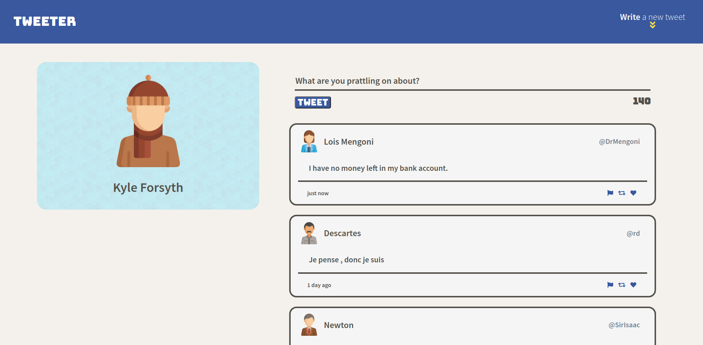
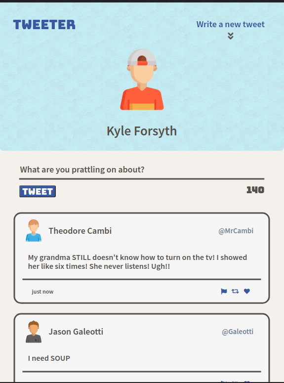
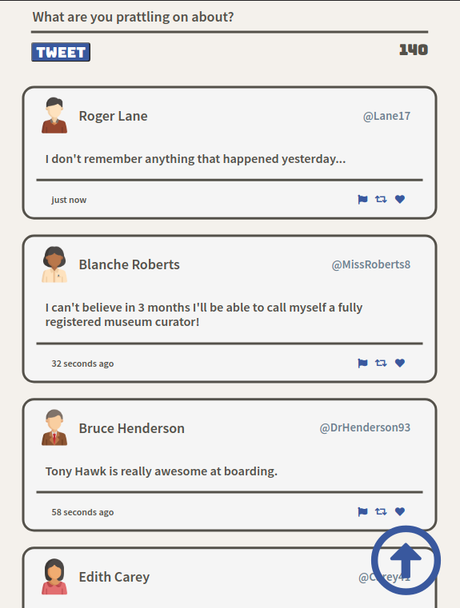
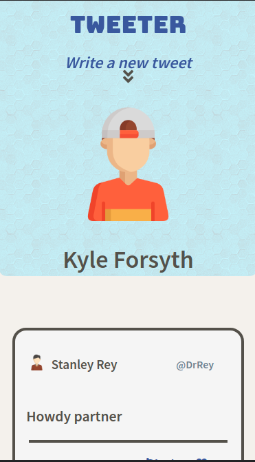
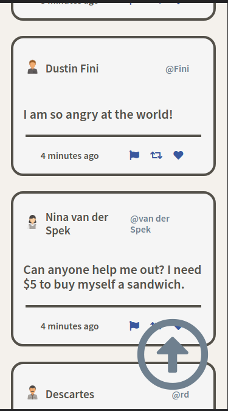

# Tweeter Project

Tweeter is a simplistic and super user-friendly Twitter clone.
I was assigned to build the entire front-end of this application. 

### The Stack:
##### - HTML
##### - CSS
##### - JS
##### - jQuery
##### - AJAX
##### - Node
##### - Express
##### - MongoDB

## Want to try it out?

1. Fork this repository, then clone your fork of this repository.
2. Install dependencies using the `npm install` command.
3. Start the web server using the `npm start` command. The app will be served at <http://localhost:8080/>.
4. Go to <http://localhost:8080/> in your browser.

## Dependencies Used

- Express
- Node 5.10.x or above
- Chance
- md5

## See it in action:

